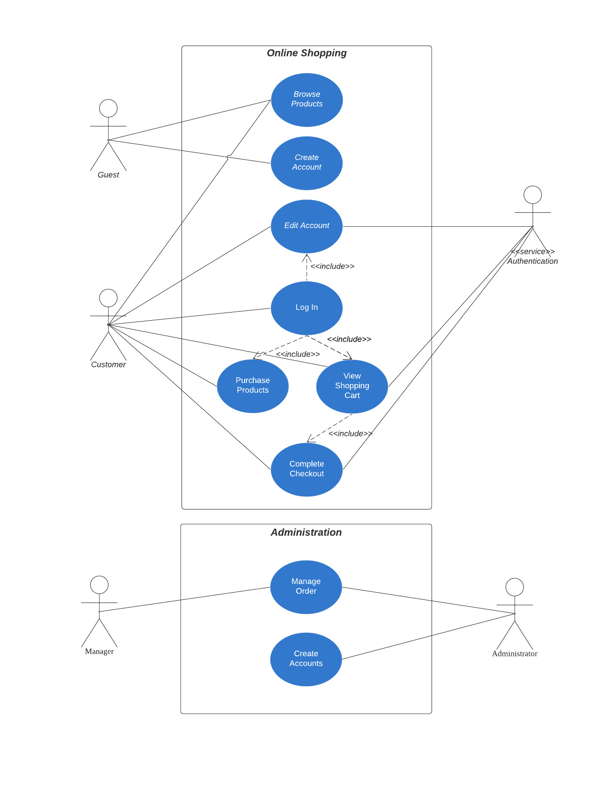

# World of Flavours - An ice cream website
## Summary

### Purpose

The goal of this project is to create a full featured website for an ice cream business to operate online.
This website is suitable for use by business owners, who have a brick-and-mortar store or are conducting 
home-based business, to reach out to more customers.

### Context

This website is created using Express with Node.js and PostgreSQL for data management.

The website provides features such as:
- sales and merchandising 
- product management
- user management
- orders management

### Demo

A live website can be accessed [here](https://project-assignment-3-express.herokuapp.com/).

## UX/UI

### Identifying Users

The main users for this website are people who are looking to buy artisanal ice cream online.

### Identifying Users' Needs and Goals

The reasons why buyers would visit the site are:
- they want to eat ice cream in the comfort of their own homes
- looking for a seller who can provide fast local delivery service to their doorsteps
- looking to try novel flavours of ice cream

### Identifying Owners' Goals

The owners' goals are:
- to reach out to more customers
- able to sell ice cream without a shop front

### User Stories

As a user of the site, I would like to:
- buy artisanal ice cream with interesting flavours
- easily make ice cream purchases on a site
- buy ice cream suitable for people with dietary restrictions
- make purchases that come with fast and fuss-free delivery service

### UX

The site is mobile responsive and it follows a tree structure. It provides features such as account logging, shopping cart and
administration functions.

Guest and logged-in users can use the site. Guest users can only browse and search for products on the site. They have to create their own
accounts to access functions such as shopping cart and submitting purchase orders.

There are three types of logged-in users. Normal users are the customers. These users can make purchases on the site and are also to view
and update their user profiles. Manager users can perform product and order management, such as creating, updating and deleting product
and order items. Administrators can do the latter and more, such as user account management.

On first access to the landing page, users will be greeted by a carousel of the latest products. A 'Shop Now' button below will take
the user directly the product menu. In the product menu, users can search and browse the products available. The products are grouped
into categories which can be accessed at the navigation bar at the top. Users can click into each product to view its details page.
The details page provides information such as description, tags and prices. Users can add the desired products into the shopping cart 
at the details page.

The shopping cart is accessed from the navigation bar. In the shopping cart, users can view the bill summary, make changes such as 
changing the product quantity and removing products from shopping cart. Users need to checkout their shopping cart to make payment.
If payment is successful, the page will show a summary of the submitted order.

### UI

The site uses a waffle design background and dark brown and white as its primary colours to fit the ice cream theme. The site features
a lot of images so that it captivates the audience and describes the products better than words.

The navigation bar is located at the top and provides access to different pages and functions based on account type. The product page displays
product information such as name, price and image using cards. The details page features an enlarged image of the product on the left side 
and product information on the right.

The following information are listed in the details page:
- product name
- description
- category
- tags that describe the flavour profile
- prices of regular and large tub sizes

## Features

### User Account

Users need to create a user account to shop on the site. Logged-in users can view their user profile information and edit them. The fields 
that are allowed for editing are first name, last name, contact and password. When changing password, the system checks that the user's new 
password does not match the previous password.

After the user logs in, the user's name and 'Log out' button are displayed at the top right corner.

### Product Menu

The product menu is where the ice cream products are displayed. The page can be accessed from the navigation bar. The navigation link provides 
a dropdown of options to show all products or specific category. This provides a pre-filtered listing. On each menu page, a search function is 
provided. It queries the pre-filtered listing using given search terms based on product name and product tags. Clicking on each product card 
redirects user to the product details page.

Logged-in users are allowed to add products to their shopping cart from the product details page. Each product has two sizes and can be added 
individually. The quantity can be adjusted in the input spinner and clicking on 'Add to cart' button adds them to the shopping cart.

### Shopping Cart

The shopping cart can be accessed from the navigation bar. User must log in to view the shopping cart. The shopping cart is a table that lists all
ice cream products added by the user. It displays the product name, size, price of each product, quantity, subtotal and total price. When the user 
changes the quantity of a chosen product, an 'Update' button will appear. Clicking on the button will update all subtotal values and total price value.
The logic is done using jQuery. The logic is also triggered on page load.

User can remove a product from shopping cart by clicking 'X' button on the left side of the table. User can click 'Return to Menu' button to return to
product menu page to continue shopping. Once ready to make payment, user will click the 'Checkout' button. User will be redirect to a checkout page created
by Stripe platform. The checkout page captures the items in the shopping cart. A flat shipping fee is added to the bill and a final total is displayed.
The user email is pre-populated from user information stored in the local session. The user will fill out the rest of the fields like name, shipping address 
and credit card details.

Upon successful payment, user will be redirected to a success page showing the order summary. This marks the end of user flow for making a purchase on the
site.

### Administration Page

The administration page is only accessible to manager and administrator account types. The navigation link will replace the shopping cart link in the 
navigation bar. The administration page has two tabs or functions: order management and account management. Manager account type can only access order management 
and the administrators can access both.

Order management page consists of a search function and a table of submitted orders. The search function can search by customers' names, email address, 
order status and delivery date. Each order displays the following information:
- user's first and last name
- email address
- contact number
- order and delivery date
- delivery address and postal code
- total amount charged to order
- order status
- a table of products ordered and their quantity

An order's order status can be updated to simulate order tracking. An entire order can also be deleted as a means of housekeeping.

## Use Cases

The Use Case diagram below describes the functions that can be performed by the different user roles.



## Technologies Used

The programming languages, frameworks, tools and APIs used in the creation of the website are listed below:

### Front-end

- HTML5
- CSS3
- JavaScript
- Bootstrap
- Bootstrap Icons
- jQuery
- Moment.js
- Axios
- Cloudinary API
- bootstrap-show-password
- bootstrap-input-spinner

jQuery is used for updating the shopping cart and used together with bootstrap-show-password and bootstrap-input-spinner plugins.
Axios is used together with Cloudinary API for uploading images.

### Back-end

- Node.js
- Express
- Handlebars
- Bookshelf.js with Knex
- Caolan form
- Stripe API

All pages are created using Handlebars. User registration, product management and search forms are created using Caolan form.
Bookshelf.js with Knex together are used for ORM. Stripe API is used for setting up the payment gateway.

### Database

- PostgreSQL
- db-migrate

db-migrate framework is used to creating tables in the database.

**Github repository:** https://github.com/waihouC/Project-Assignment-3-Express

## Testing

Test cases can be found [here](public/doc/Assignment-3-test-cases.pdf).

## Deployment

### Deploying application to Heroku

The website is hosted on Heroku. To deploy, start by creating a Procfile with the following line.

```
web: node index.js
```

Add the start script to package.json.

```
"scripts": {
    "test": "echo \"Error: no test specified\" && exit 1",
    "start": "node index.js"
},
```

Deploy the app to Heroku with the following steps: [[Reference]](https://devcenter.heroku.com/articles/deploying-nodejs#deploy-your-application-to-heroku)

```
git add .
git commit -m "Added a Procfile."
heroku login -i
Enter your Heroku credentials.
...
heroku create
...
git push heroku main
```

### Setting Up The Database

Heroku provides PostgreSQL as a managed SQL database service. Start provisioning Heroku Postgres by running the following command:

```
heroku addons:create heroku-postgresql
```

Log into Heroku and open the application link. Go to the Settings tab and click 'Reveal config vars' button.

Use DATABASE_URL config provided by Heroku for the environment variables. These variables are needed to create a connection string to the database.
Add the following environment variables to both the .env file and config vars:

- DB_DRIVER
- DB_USER
- DB_PASSWORD
- DB_DATABASE
- DB_HOST

Also, add the following environment variables that are used for Cloudinary service and Stripe service:

- CLOUDINARY_NAME
- CLOUDINARY_API_KEY
- CLOUDINARY_API_SECRET
- CLOUDINARY_UPLOAD_PRESET
- STRIPE_PUBLISHABLE_KEY
- STRIPE_SECRET_KEY
- STRIPE_SUCCESS_URL
- STRIPE_CANCEL_URL
- STRIPE_ENDPOINT_SECRET
- SESSION_SECRET_KEY

### Creating The Tables

Create the required tables by running the following commands:

```
yarn add pg
yarn add db-migrate-pg
./db-migrate.sh up
```

### Dependencies

The dependencies required by the project are as follows:

```
"dependencies": {
    "body-parser": "^1.19.0",
    "bookshelf": "^1.2.0",
    "bootstrap-input-spinner": "^3.1.7",
    "cloudinary": "^1.27.1",
    "connect-flash": "^0.1.1",
    "cors": "^2.8.5",
    "csurf": "^1.11.0",
    "db-migrate": "^1.0.0-beta.16",
    "db-migrate-mysql": "^2.2.0",
    "db-migrate-pg": "^1.2.2",
    "dotenv": "^10.0.0",
    "express": "^4.17.1",
    "express-session": "^1.17.2",
    "forms": "^1.3.2",
    "handlebars-helpers": "^0.10.0",
    "hbs": "^4.1.2",
    "knex": "^0.95.12",
    "moment": "^2.29.1",
    "mysql": "^2.18.1",
    "mysql2": "^2.3.0",
    "pg": "^8.7.1",
    "session-file-store": "^1.5.0",
    "stripe": "^8.191.0",
    "wax-on": "^1.2.2"
 }
 ```

 ## Credits

 This project is made possible with the following help:

 ### Images

 - https://www.kitchencraft.co.uk/articles/creating-a-world-of-flavours.htm
 - https://pixy.org/4002266/
 - https://chocolatecoveredkatie.com/banana-ice-cream-healthy/
 - https://icon-library.com/icon/ice-cream-icon-png-16.html
 - https://livinghealthywithchocolate.com/lychee-ice-cream-recipe/
 - https://lickers.com.sg/

 ### Code

 - https://stackoverflow.com/questions/23101966/bootstrap-alert-auto-close
 - https://bootstrap-show-password.wenzhixin.net.cn/getting-started/
 - https://stackoverflow.com/questions/54404865/make-bootstrap-card-entirely-clickable
 - https://shaack.com/projekte/bootstrap-input-spinner/
 - https://stackoverflow.com/questions/65314936/how-to-get-anon-aysnc-function-lineitems-out-of-stripe-checkout-session-listline/65314977
 - https://stackoverflow.com/questions/13046401/how-to-set-selected-select-option-in-handlebars-template

 **And instructors’ advice from Trent Global College.**